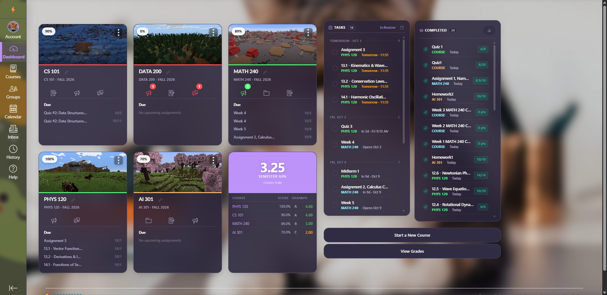
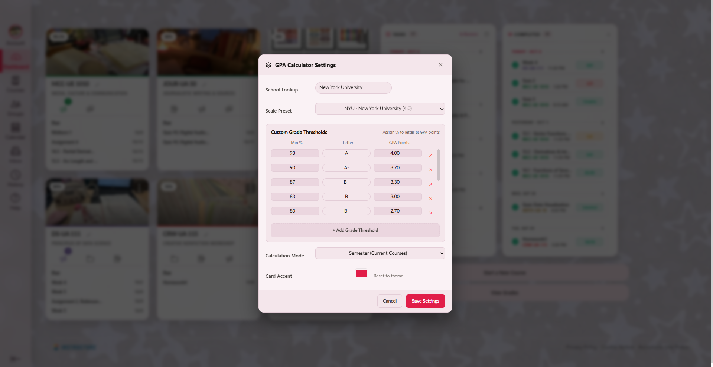
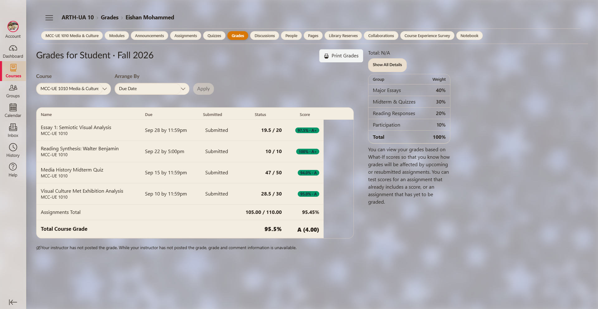

# CanvasCustomizer (CC) 🎨

A free, clean, and aesthetic way to customize Canvas.

[-10B981?style=for-the-badge&logo=googlechrome&logoColor=white)](https://github.com/EISHANnyc/CanvasCustomizer/raw/main/CanvasCustomizer.zip)

*(Direct 1-click clean download — no screenshots, lightweight 110KB build, ready to extract & load immediately)*

---
If you find any bugs, idk how you can tell me but just tell me somehow okay?

## Features

- Three preset themes and one custom theme (light & dark modes)
- Editable premade palettes (Sunny Beach Day, Olive Garden Feast, Summer Ocean Breeze) and Palette Studio with custom saving
- GPA calculator with universal preset scales (4.0 & 4.33) and fully customizable percentage-to-letter/GPA breakdown editor
- Ability to set a custom wallpaper and sidebar background image with blur/opacity controls
- Ability to put custom photos on course cards with crop and zoom
- Task list and Completed list for upcoming & recently finished assignments, quizzes, and tests
- Clean compact grades table, rounded cards, and themed dropdowns
- Very lightweight (< 120KB)

---

## Preview

---

## Installation

1. **Download the Clean Extension**:
   - Click the green [**Download Clean Extension ZIP**](https://github.com/EISHANnyc/CanvasCustomizer/raw/main/CanvasCustomizer.zip) button above.
   - Extract the ZIP on your computer.

2. **Open Extensions in Chrome**:
   - Go to `chrome://extensions` in your address bar.
   - Turn on **Developer mode** in the top-right corner.

3. **Load the Extension**:
   - Click **Load unpacked**.
   - Select the extracted `CanvasCustomizer` folder.
   - Open Canvas and click the extension icon to start customizing!

---

I used Antigravityy for this. I just wanted a free alternative to a paid alternate one.
## License

[MIT](LICENSE) © 2026 Eishan M
